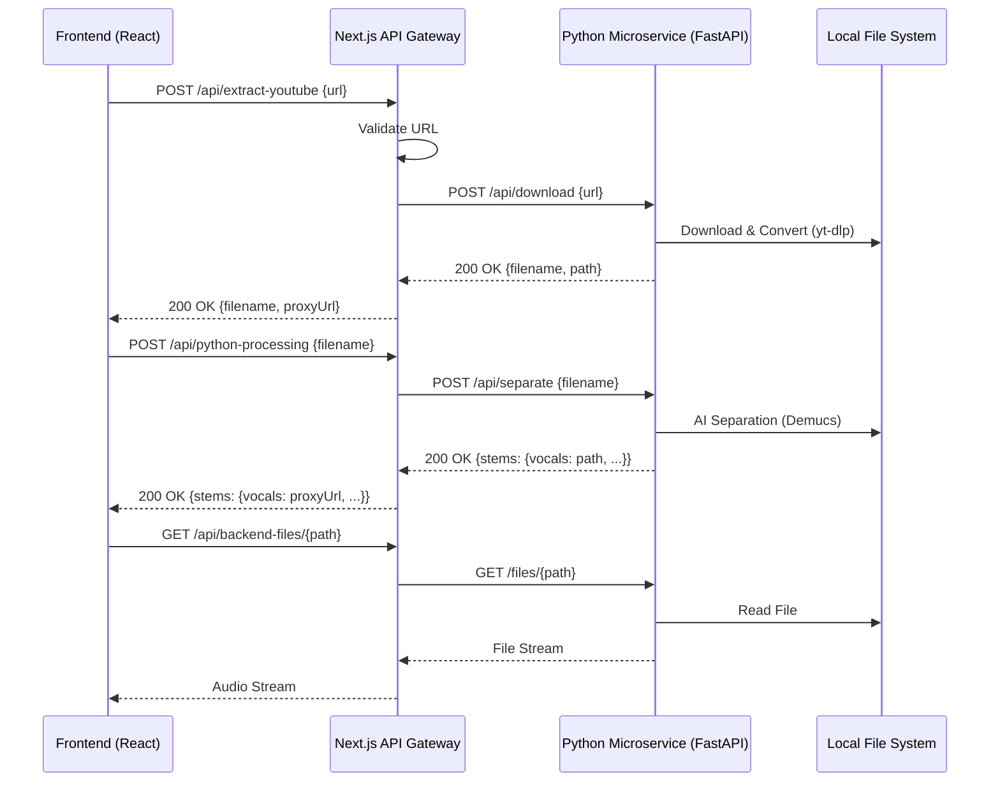

# YouTube Integration & Audio Processing Architecture

## ⚠️ LEGAL DISCLAIMER

**FOR EDUCATIONAL AND PERSONAL USE ONLY.** This system enables the extraction of audio from YouTube links which may violate YouTube's Terms of Service. Users are responsible for ensuring they have the legal right to download and process the content.

---

## 🏗️ System Architecture Redesign

The backend has been refactored from a monolithic Next.js API into a microservices-based architecture to optimize resource-intensive audio processing tasks.

### 1. High-Level Components

- **Next.js Frontend/API Gateway:** Handles user requests, validation, and security.
- **Python Audio Microservice (FastAPI):** Specialized service for high-performance audio downloading (`yt-dlp`) and AI-based vocal separation (`Demucs`).
- **File Storage Proxy:** A secure bridge for serving processed files from the microservice to the frontend.

### 2. End-to-End Workflow



---

## 🔌 API Communication Protocols

### Next.js Gateway ↔ Python Microservice

- **Protocol:** HTTP/JSON
- **Base URL:** `http://localhost:8000` (configurable via `PYTHON_SERVICE_URL`)
- **Authentication:** Currently internal network trust (recommended: JWT or API Key for production).

#### Endpoints

| Method | Endpoint | Description |
|--------|----------|-------------|
| POST | `/api/download` | Downloads audio from YouTube. Returns relative file path. |
| POST | `/api/separate` | Runs AI separation on a downloaded file. Returns paths to stems. |
| GET | `/api/library` | Scans the storage and returns available tracks and stems. |
| GET | `/files/{path}` | Serves the actual audio files. |

---

## 🛡️ Error Handling Strategies

The integration implements a multi-layer error handling strategy:

1. **Validation Layer (Gateway):** Pre-validates YouTube URLs and request parameters before hitting the microservice.
2. **Circuit Breaker & Timeouts (Communication):**
    - **Download Timeout:** 60 seconds.
    - **Separation Timeout:** 300 seconds (5 minutes).
    - **AbortControllers:** Ensures resources are released if a request hangs.
3. **Microservice Resilience:**
    - Lazy initialization of heavy AI models to save memory.
    - Graceful handling of `yt-dlp` errors (403, 429, Private videos).
4. **Format Compatibility:**
    - Automatic conversion to high-bitrate MP3 (192kbps) for downloads.
    - AI stems provided in high-fidelity WAV format for processing.

---

## ⚡ Resource Management & Concurrency

Processing audio is CPU/GPU and memory intensive. The system manages this via:

- **Decoupled Execution:** Heavy lifting is offloaded to the Python service, keeping the Next.js event loop free for user interactions.
- **Lazy Model Loading:** The separation model is loaded only when needed and can be shared across concurrent requests (hardware permitting).
- **Stream-based Proxying:** The Next.js Gateway uses `Response.body` (ReadableStream) to proxy files from the microservice, minimizing memory footprint on the gateway server.
- **Concurrency Scaling:** For high-traffic environments, the Python microservice should be deployed in a containerized environment (Docker/Kubernetes) with GPU acceleration and worker scaling.

---

## 🚀 Deployment & Configuration

### Environment Variables

```bash
# Next.js (.env.local)
PYTHON_SERVICE_URL=http://localhost:8000
```

### Running the Python Service

```bash
cd python-audio-cli
# Setup environment
bash setup.sh
# Start server
bash start-backend.sh
```

---

## 📝 Maintenance & Logs

- **Next.js Logs:** Available in the terminal running `npm run dev`.
- **Python Service Logs:** Tail logs from `python-audio-cli/api.py` execution.
- **Storage:** Processed files are stored in `python-audio-cli/output/`.
