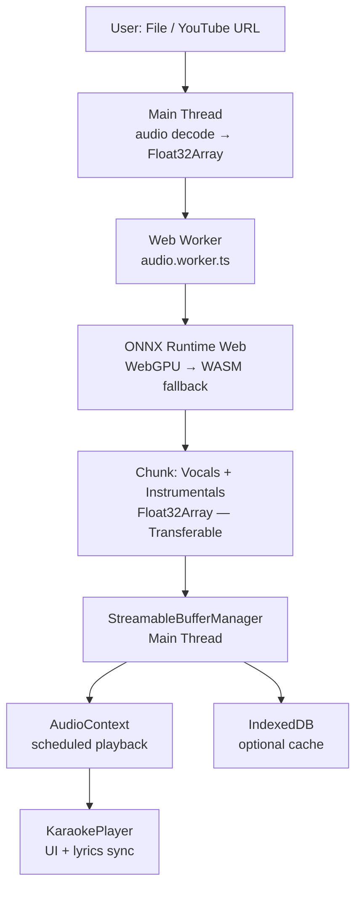

# Progressive Client-Side Audio Processing Architecture

> **Last Reviewed**: February 2026 | **Status**: Implemented ✅

## Overview

This document outlines the architectural design for the client-side audio separation pipeline using ONNX Runtime Web + WebGPU. The core design goal is **progressive streaming inference**: playback can start before the entire file is processed, while keeping peak memory usage minimal.

## System Data Flow




## Core Components

### 1. Main Thread (UI & Orchestration)


- **Responsibility**: User interaction, audio decoding (initial), playback scheduling, and visualization.
- **Key Components**:
  - `StreamableBufferManager`: A new utility class that manages the playback queue. It receives processed chunks from the worker and schedules them on the `AudioContext`.
  - `separateAudio.ts`: The bridge between the UI and the Worker. Refactored to handle streams of data rather than a single large promise resolution.

### 2. Web Worker (Inference Engine)

- **Responsibility**: Heavy ML inference, audio segmentation, and overlap-add reconstruction.
- **Key Components**:
  - `audio.worker.ts`: The main worker script.
  - `InferenceEngine`: Wraps ONNX Runtime sessions.
  - `StreamProcessor` (Internal Logic): A progressive processor that maintains a small "overlap" buffer. It processes one segment, stitches it with the previous tail, and immediately sends the valid "center" part to the main thread.

### 3. ONNX Runtime Web (WebGPU)

- **Responsibility**: Accelerating tensor operations.
- **Configuration**:
  - Execution Provider: `webgpu` (primary), `wasm` (fallback).
  - Layout: `NCHW` (standard for audio models like Demucs/MDX).
  - Graph Optimization: `all`.
  - Free Dimension Overrides: Fixed batch size (1) to optimize memory allocation.

## Data Flow Pipeline

1. **Input**: User selects an audio file.
2. **Decoding**: Main thread decodes the file into an `AudioBuffer`.
3. **Initialization**:
    - `StreamableBufferManager` is initialized.
    - Worker is spawned and model is loaded.
4. **Streaming Inference**:
    - Main thread transfers the raw `Float32Array` audio data to the Worker (using `Transferable` to avoid copy).
    - Worker segments the audio into chunks (e.g., ~10s).
    - **Loop**:
        - Worker runs inference on Chunk N.
        - Worker merges Chunk N with the tail of Chunk N-1 (Overlap-Add).
        - Worker identifies the "safe" region (fully overlapped and resolved).
        - Worker transfers the "safe" region (Vocals + Instrumental) back to Main Thread immediately.
        - Worker retains only the "tail" for the next iteration.
5. **Playback**:
    - `StreamableBufferManager` receives the chunk.
    - If it's the first chunk, it buffers slightly (e.g., 200ms) and schedules playback.
    - Subsequent chunks are scheduled to play precisely at the end of the previous chunk.
6. **Completion**:
    - Worker sends the final tail.
    - `StreamableBufferManager` finalizes the streams.
    - Full results can be cached (optional, constructed from chunks if needed for save).

## Memory Optimization Strategy

- **Zero-Copy Transfers**: Heavy use of `Transferable` objects between Main Thread and Worker.
- **Rolling Buffers**: The worker never holds the full output file. It only holds:
  - Current Input Segment (~10s)
  - Current Output Segment (~10s)
  - Overlap Tail (~1s)
- **Garbage Collection**: Tensor cleanup is performed immediately after inference of each chunk.

## Detailed component designs

### StreamableBufferManager

```typescript
class StreamableBufferManager {
  addChunk(vocals: Float32Array, instrumentals: Float32Array): void;
  play(): void;
  pause(): void;
  seek(time: number): void;
}
```

### ONNX Configuration

```typescript
const options = {
  executionProviders: [
    {
      name: 'webgpu',
      devicePreference: 'high-performance',
      preferredLayout: 'NCHW'
    }
  ],
  freeDimensionOverrides: {
    input: [1, 2, sequence_length]
  }
}
```
