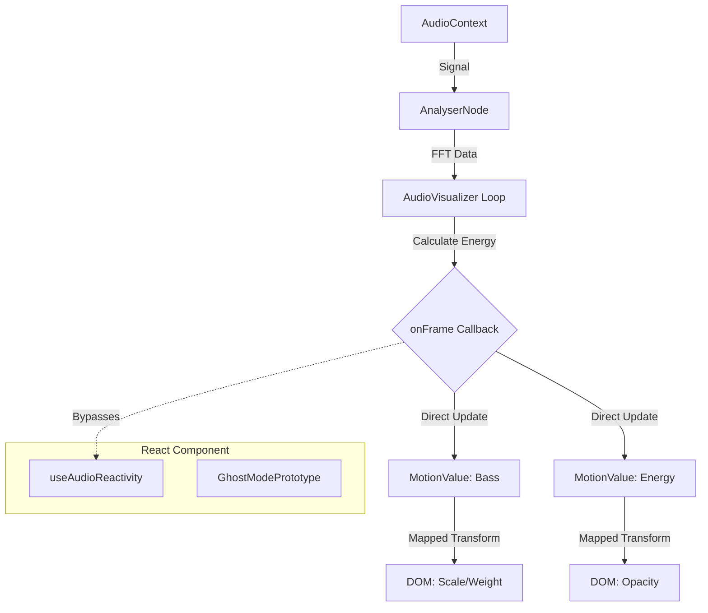

# Ghost Mode: Audio-Reactive Typography Specification

## 1. Executive Summary
"Ghost Mode" is a high-performance visual effect where lyric typography reacts instantaneously to audio frequency transients. This system uses a direct-coupling architecture to map audio analysis data to visual properties without incurring the overhead of the React render cycle, ensuring 60fps+ performance even on mobile devices.

## 2. Architecture & Data Flow

The system operates on a unidirectional data flow principle designed to bypass the React Virtual DOM for high-frequency updates.

### Data Flow Pipeline
1.  **Audio Source**: The Web Audio API `AudioContext` provides the raw signal.
2.  **Analysis Node**: An `AnalyserNode` captures the FFT (Fast Fourier Transform) frequency data.
3.  **Visualizer Loop (Main Thread)**:
    *   `requestAnimationFrame` drives the `AudioVisualizer.draw()` loop.
    *   Inside this loop, `AudioVisualizer.processAudioFeatures()` calculates spectral energy for Bass, Mids, and Treble.
    *   **Crucial Step**: The loop invokes `onFrame(metrics)`, passing a lightweight object directly to the consumer.
4.  **Bridge Hook (`useAudioReactivity`)**:
    *   This hook registers the callback with the Visualizer.
    *   It maintains persistent `MotionValue` references (from `framer-motion`).
    *   When the callback fires, it calls `.set(value)` on these MotionValues. **This does not trigger a React state update or re-render.**
5.  **Render Layer (`GhostModePrototype`)**:
    *   The component binds these MotionValues to the DOM styles via `motion.div`.
    *   `framer-motion` manages the CSS style updates outside the React commit phase.
    *   The browser's compositor thread handles the visual changes (Scale, Opacity, Filter).



## 3. Component Interface

### Hook: `useAudioReactivity`
Extracts audio features and returns mutable motion values.

**Signature:**
```typescript
function useAudioReactivity(visualizer: AudioVisualizer | null): AudioMetrics
```

**Return Value (`AudioMetrics`):**
| Property | Type | Description |
| :--- | :--- | :--- |
| `bass` | `MotionValue<number>` | Normalized energy (0.0 - 1.0) in the 20Hz - ~250Hz range. Represents "kick" and "sub". |
| `mid` | `MotionValue<number>` | Normalized energy in the ~250Hz - ~4kHz range. Represents vocals and instruments. |
| `treble` | `MotionValue<number>` | Normalized energy in the >4kHz range. Represents "air", sibilance, and hi-hats. |
| `energy` | `MotionValue<number>` | Root Mean Square (RMS) of the entire spectrum. Represents overall loudness. |

### Component: `GhostModePrototype`
Renders the lyric text with the Ghost Mode effect applied.

**Props:**
```typescript
interface GhostModeProps {
    text: string;                     // The lyric line to display
    isActive: boolean;                // Whether this line is currently being sung
    visualizer: AudioVisualizer | null; // Reference to the active audio engine
}
```

## 4. Visual Mapping Strategy

The system maps specific audio frequency ranges to distinct visual properties to create an organic, "alive" feel. Physics-based smoothing (`useSpring`) is applied to raw inputs to prevent visual jitter.

| Audio Feature | Frequency Range | Visual Property | Mapping Logic | Aesthetic Effect |
| :--- | :--- | :--- | :--- | :--- |
| **Bass** | 20Hz - 250Hz | `scale` | `0.0 -> 0.8` maps to `1.0 -> 1.4` | Text "pulses" to the beat (Kick Drum). |
| **Bass** | 20Hz - 250Hz | `font-weight` | `0.0 -> 1.0` maps to `400 -> 900` | Text gets "heavier" and bolder on strong beats. |
| **Energy** | Full Spectrum | `opacity` | `0.0 -> 1.0` maps to `0.6 -> 1.0` | Text flickers slightly with intensity; never fully invisible. |
| **Treble** | > 4kHz | `x` (Offset) | `0.0 -> 1.0` maps to `0px -> 5px` | High frequencies cause a chromatic aberration "shake" or "glitch". |
| **Treble** | > 4kHz | `filter: blur()` | `0.0 -> 1.0` maps to `0px -> 2px` | Subtle blur on sharp transients adds a "ghostly" feel. |

**Physics Configuration:**
*   **Bass/Scale**: Stiffness 200, Damping 15 (Punchy, fast return)
*   **Energy/Opacity**: Stiffness 100, Damping 20 (Smoother, lingering)

## 5. Performance Guidelines

To maintain 60fps performance on all devices, strict adherence to these guidelines is required:

1.  **Hardware Acceleration**:
    *   **ALLOWED**: `transform` (translate, scale, rotate), `opacity`, `filter`.
    *   **FORBIDDEN**: `width`, `height`, `margin`, `padding`, `top`, `left` (triggers layout thrashing).
    *   **Use `will-change`**: Apply `will-change: transform` to the active lyric container to hint the browser to promote it to a new layer.

2.  **React Optimization**:
    *   The `useAudioReactivity` hook **MUST NOT** return React state (`useState`). It must return `MotionValues`.
    *   The `GhostModePrototype` component **MUST NOT** use `useEffect` to update styles based on audio.

3.  **Memory Management**:
    *   The `AudioVisualizer` must clean up the `onFrame` callback when the component unmounts to prevent memory leaks.
    *   `useAudioReactivity` handles this cleanup automatically in its return function.

4.  **Variable Fonts**:
    *   Animating `font-weight` is expensive if it triggers font file swapping.
    *   **Requirement**: Use a Variable Font (e.g., Inter Variable) and animate `font-variation-settings` or the numeric `fontWeight` property which browsers can interpolate efficiently.
